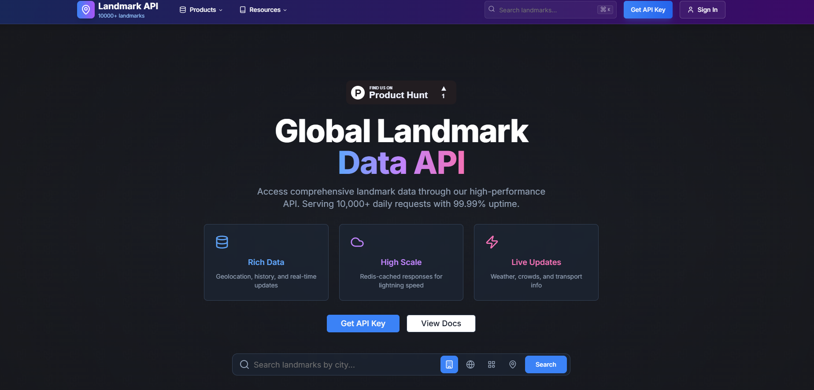
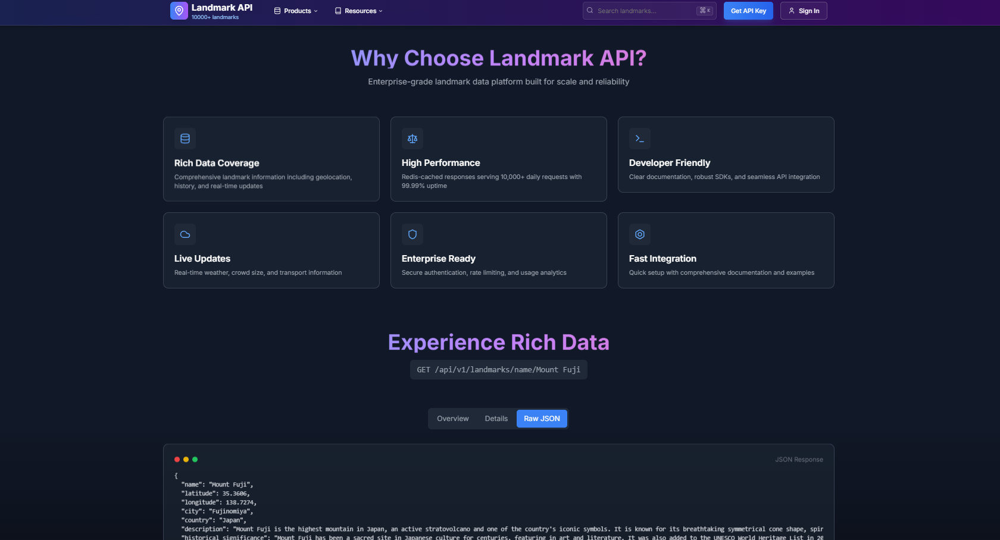
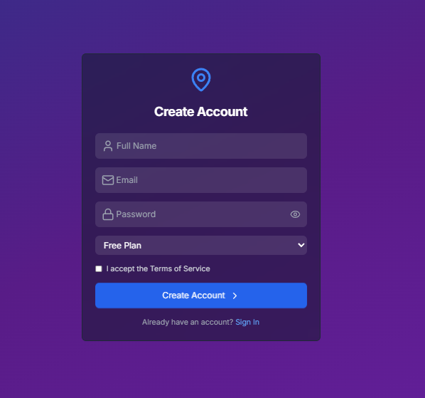
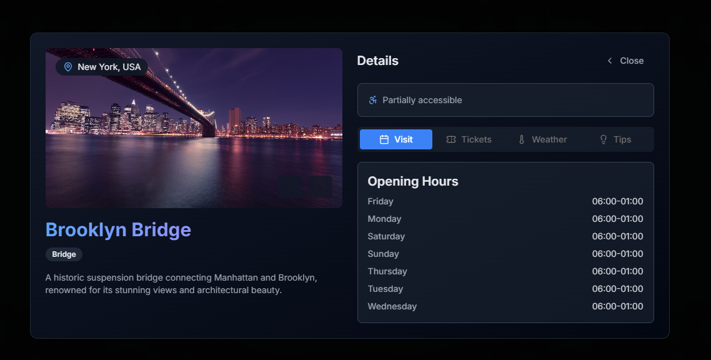

# Landmark API Frontend v2


This project is the frontend for the Landmark API, an application that provides real-time data on landmarks across the globe. Built with **Next.js** and **React**, it provides an intuitive and responsive interface for accessing detailed landmark information, including images, historical data, and live updates. This frontend interacts with the backend [Landmark API](https://github.com/Gravgor/landmark-api) and supports multiple user access levels with detailed landmark data and real-time features.

## Table of Contents

- [Features](#features)
- [Screenshots](#screenshots)
- [Installation](#installation)
- [Usage](#usage)
- [Configuration](#configuration)
- [Contributing](#contributing)
- [License](#license)

---

## Features

- **Detailed Landmark Information:** Access historical, geographical, and visitor information.
- **Real-time Data:** View live updates like weather, crowd size, and public transport.
- **Responsive Design:** Optimized for various devices and screen sizes.
- **Image Storage via AWS S3:** Displays multiple images per landmark.
- **User Authentication:** Secure access through API keys for registered users.
- **Role-based Access Control:** Different access levels for Free, Pro, and Enterprise users.

## Screenshots

<!-- Include screenshots here -->
<!-- Example:  -->









## Installation

To run this project locally:

1. **Clone the repository:**
   ```bash
   git clone https://github.com/Gravgor/landmark-api-frontend-v2.git
   cd landmark-api-frontend-v2
   ```

2. **Install dependencies:**
   ```bash
   npm install
   ```

3. **Set up environment variables:**  
   Create a `.env.local` file in the root directory and add the following:

   ```bash
   NEXT_PUBLIC_API_URL=your_api_url
   NEXT_PUBLIC_S3_BUCKET_URL=your_s3_bucket_url
   ```

4. **Run the development server:**
   ```bash
   npm run dev
   ```

5. Open your browser and navigate to `http://localhost:3000`.

## Usage

This project provides a user-friendly interface for accessing the Landmark API. Some key user interactions include:

- **Search and Browse:** Find landmarks using filters like categories, location, and historical events.
- **View Detailed Information:** Check landmark data, including real-time updates.
- **User Account Access:** Log in to access personalized dashboard features.

## Configuration

To use all features, configure access to the [Landmark API](https://github.com/Gravgor/landmark-api) backend. Set up the API to include the necessary authentication, data sources, and environment variables.

### Environment Variables

- **NEXT_PUBLIC_API_URL:** The base URL for your backend Landmark API.
- **NEXT_PUBLIC_S3_BUCKET_URL:** The AWS S3 bucket URL for landmark images.

## Contributing

We welcome contributions! Here’s how you can help:

1. **Fork the repository** and create your branch from `main`.
2. **Clone your forked repo** and make changes.
3. **Submit a pull request** with a clear description of your changes.

## License

This project is licensed under the MIT License. See the [LICENSE](LICENSE) file for details.
